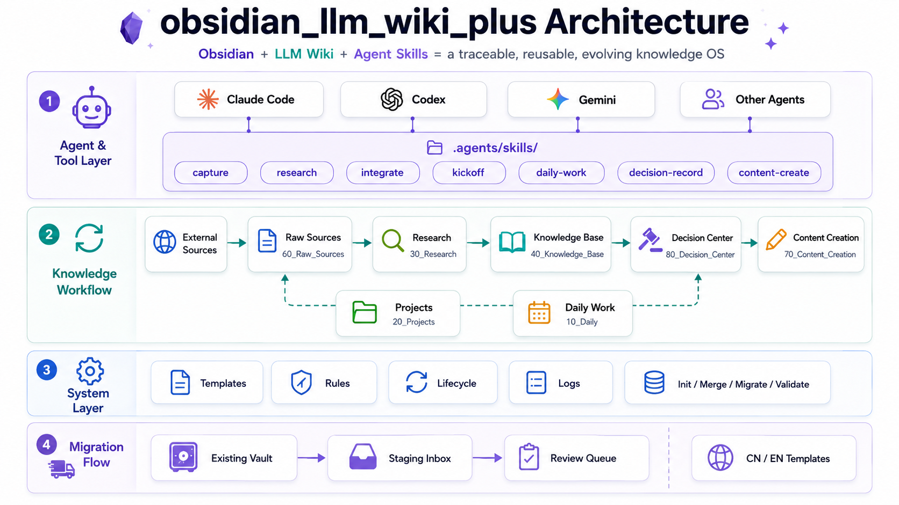

# obsidian_llm_wiki_plus

<p align="center">
  
</p>

**English** | [中文](./README_CN.md)

**Obsidian + LLM Wiki + Agent Skills = a traceable, reusable, and evolving knowledge operating system.**

`obsidian_llm_wiki_plus` is a bilingual Obsidian Vault template designed for people who want AI agents to help maintain a long-term knowledge system. It functions as a structured "knowledge OS" that sits on top of your existing Obsidian vault, providing the folder structure, metadata standards, and workflow scripts required for AI agents to perform reliable research, synthesis, and maintenance.

It combines raw source capture, deep research, structured wiki integration, project execution, daily review, content creation, decision records, and safe vault upgrades into one agent-friendly Obsidian workflow.

You can use the `CN/` or `EN/` vault template directly, or install, merge, migrate, and upgrade it with the built-in CLI.

---

## Why this project exists

Most personal knowledge bases eventually run into the same problems:

1. **Sources are hard to trace**  
   You read web pages, papers, GitHub repositories, PDFs, docs, and videos, but later you cannot tell where a conclusion came from.

2. **Notes do not automatically become knowledge**  
   Many notes stay isolated. They are not integrated as entities, concepts, claims, workflows, decisions, comparisons, or synthesis pages.

3. **AI conversations are valuable but easy to lose**  
   LLM chats often contain useful plans, technical judgments, writing ideas, and project decisions, but they usually remain trapped in chat history.

4. **Research, projects, and content are disconnected**  
   Research does not always become reusable knowledge. Project lessons do not always become methodology. Content creation often starts from scratch.

5. **Knowledge ages**  
   AI tools, models, APIs, architecture choices, and product strategies change quickly. Old conclusions need lifecycle metadata and review reminders.

This project turns an Obsidian Vault into a structured knowledge operating system that AI agents can safely work inside.

---

## Who is it for?

This project is useful for:

- technical builders tracking AI, agents, LLMs, local models, tools, and engineering practices;
- people who want project experience, architecture decisions, and technical analysis to become reusable knowledge assets;
- content creators who want X posts, newsletters, Rednote posts, and video scripts to grow from a real knowledge base;
- Obsidian users who want AI agents to participate in capture, research, integration, review, and writing;
- teams or individuals who care about source traceability and decision review.

It is not intended to be a minimal diary template or a simple to-do list system.

---

## Quick start

### Option 1: one-command install from GitHub

Install the Chinese vault template:

```bash
npx github:twj515895394/obsidian_llm_wiki_plus install --lang CN --target ./my-vault
```

Install the English vault template:

```bash
npx github:twj515895394/obsidian_llm_wiki_plus install --lang EN --target ./my-vault
```

If the target directory is empty, the installer initializes a new vault.

If the target directory is not empty, it asks whether to:

1. merge missing template files;
2. overwrite template files;
3. migrate another source directory into the vault staging area;
4. cancel.

By default, the installer does **not** delete old files and does **not** overwrite existing files without confirmation.

### Option 2: use the local Python tools

After cloning the repository:

```bash
git clone git@github.com:twj515895394/obsidian_llm_wiki_plus.git
cd obsidian_llm_wiki_plus
python tools/init.py --lang EN --target ./my-vault
```

Chinese version:

```bash
python tools/init.py --lang CN --target ./my-vault
```

### Option 3: copy a template directory manually

```bash
cp -r EN my-vault
# or
cp -r CN my-vault
```

Manual copy is still supported, but the CLI installer is recommended for real use.

---

## Upgrade an existing vault

If you already use an older `obsidian_llm_wiki_plus` vault, use the safe upgrade flow instead of copying the whole template again.

Check health first:

```bash
npx github:twj515895394/obsidian_llm_wiki_plus doctor --lang EN --target ./my-vault
```

View differences:

```bash
npx github:twj515895394/obsidian_llm_wiki_plus diff --lang EN --target ./my-vault
```

Generate an upgrade plan without modifying files:

```bash
npx github:twj515895394/obsidian_llm_wiki_plus upgrade --lang EN --target ./my-vault
```

Apply safe additions after review:

```bash
npx github:twj515895394/obsidian_llm_wiki_plus upgrade --lang EN --target ./my-vault --apply
```

Upgrade strategy:

- existing files are not overwritten by default;
- user files are never deleted;
- user content is never moved automatically;
- `--apply` only copies safe missing files such as new skills and command adapters;
- different entry files, template files, and README files are staged under `.olwp/upgrade-staging/` for manual merge;
- upgrade plans are written to `90_Planning/review-queue/`;
- upgrade manifests are written to `99_System/logs/`.

Full command guide:

- [EN/OLWP_COMMANDS.md](./EN/OLWP_COMMANDS.md)
- [CN/OLWP_COMMANDS.md](./CN/OLWP_COMMANDS.md)

---

## Migrate an existing Obsidian Vault

If you already have an Obsidian Vault or a Markdown document folder, do not move everything directly into `40_Knowledge_Base/`.

Use the migration workflow instead:

```bash
npx github:twj515895394/obsidian_llm_wiki_plus migrate \
  --lang EN \
  --source ./old-vault \
  --target ./new-vault \
  --init-template \
  --apply
```

For the Chinese version:

```bash
npx github:twj515895394/obsidian_llm_wiki_plus migrate \
  --lang CN \
  --source ./old-vault \
  --target ./new-vault \
  --init-template \
  --apply
```

Migration is designed to be safe:

- it copies files instead of moving them;
- it does not delete the old vault;
- it imports old documents into a staging area;
- it generates a migration plan and manifest;
- the user and agent can later process migrated notes with `research`, `integrate`, and `decision-record`.

---

## Ask an AI agent to install it

You can tell your coding agent:

```text
Install obsidian_llm_wiki_plus into the current Obsidian Vault.
Use https://github.com/twj515895394/obsidian_llm_wiki_plus.
If the directory is empty, initialize the EN version.
If it is not empty, ask whether I want to merge the template, overwrite template files, or migrate existing documents.
Do not overwrite existing files without confirmation.
```

The agent should run something like:

```bash
npx github:twj515895394/obsidian_llm_wiki_plus install --lang EN --target .
```

For Chinese users:

```bash
npx github:twj515895394/obsidian_llm_wiki_plus install --lang CN --target .
```

See also:

- [Agent install guide](./docs/EN/agent-install.md)
- [Automation guide](./docs/EN/automation.md)

---

## Repository structure

```text
obsidian_llm_wiki_plus/
├── README.md
├── README_CN.md
├── LICENSE
├── package.json
├── bin/
│   └── olwp.mjs
├── docs/
│   ├── CN/
│   └── EN/
├── tools/
├── CN/
└── EN/
```

| Path | Description |
|---|---|
| `README.md` | English README |
| `README_CN.md` | Chinese README |
| `CN/` | Chinese Obsidian Vault template |
| `EN/` | English Obsidian Vault template |
| `docs/CN/` | Chinese design and usage docs |
| `docs/EN/` | English design and usage docs |
| `tools/` | Python init, migration, and validation tools |
| `bin/olwp.mjs` | Node CLI installer for `npx github:...` usage |
| `package.json` | CLI package metadata |

---

## Vault structure

### English template

```text
EN/
├── START_HERE.md
├── README.md
├── CLAUDE.md
├── AGENTS.md
├── GEMINI.md
├── OLWP_COMMANDS.md
├── 00_Inbox/
├── 10_Daily/
├── 20_Projects/
├── 30_Research/
├── 35_QA_Library/
├── 40_Knowledge_Base/
├── 50_Resources/
├── 60_Raw_Sources/
├── 70_Content_Creation/
├── 80_Decision_Center/
├── 90_Planning/
├── 99_System/
├── .agents/
├── .claude/
├── .gemini/
└── .codex/
```

### Chinese template

```text
CN/
├── START_HERE.md
├── README.md
├── CLAUDE.md
├── AGENTS.md
├── GEMINI.md
├── OLWP_COMMANDS.md
├── 00_收件箱/
├── 10_日记/
├── 20_项目/
├── 30_研究/
├── 35_问答沉淀/
├── 40_知识库/
├── 50_资源/
├── 60_原始资料/
├── 70_内容创作/
├── 80_决策中心/
├── 90_计划/
├── 99_系统/
├── .agents/
├── .claude/
├── .gemini/
└── .codex/
```

---

## Agent Skills

The main skill source is:

```text
.agents/skills/
```

The current version includes 10 core skills:

| Skill | Purpose |
|---|---|
| `ask` | Quick Q&A, short explanations, lightweight judgments, and simple placement decisions without over-engineering. |
| `capture` | Capture external links, GitHub repositories, PDFs, local files, web pages, videos, papers, and long-form text. |
| `research` | Perform deep research on projects, technologies, tools, products, and topics. |
| `integrate` | Integrate research results, Q&A entries, project lessons, and unstructured text into the structured wiki. |
| `kickoff` | Start a new project, system, topic, or long-running initiative. |
| `daily-work` | Support start-day workflows, daily planning, daily logs, and daily reviews. |
| `decision-record` | Record technical selections, architecture decisions, product judgments, content strategies, and project roadmap decisions. |
| `content-create` | Create X posts, newsletters, Rednote posts, video scripts, and content briefs from the knowledge base. |
| `archive` | Archive completed projects, processed inbox items, outdated plans, and phase-complete materials. |
| `obsidian-markdown` | Define frontmatter, wikilinks, callouts, embeds, tags, and attachment references for Obsidian Markdown. |

Tool-specific folders are adapters only:

```text
.claude/commands/
.gemini/commands/
.codex/commands/
```

They point to `.agents/skills/` instead of duplicating rules.

---

## Core design principles

1. **Traceable sources**  
   Raw links, files, screenshots, PDFs, videos, and pasted text should be captured as raw sources before being turned into conclusions.

2. **Separation of evidence and interpretation**  
   `60_Raw_Sources/` stores evidence. `30_Research/` stores analysis. `40_Knowledge_Base/` stores reusable knowledge. `80_Decision_Center/` stores important decisions.

3. **Evolving wiki**  
   Knowledge pages should include metadata such as sources, status, confidence, review dates, and open questions.

4. **Safe migration and upgrade**  
   Existing notes are imported into an inbox staging area first. Existing vault upgrades generate plans by default and never overwrite user content automatically.

5. **Agent-friendly execution**  
   Complex operations are routed through short, focused skills rather than one giant instruction file.

---

## Documentation

English docs:

- [Design](./docs/EN/design.md)
- [Usage guide](./docs/EN/usage-guide.md)
- [Skill system](./docs/EN/skill-system.md)
- [Directory map](./docs/EN/directory-map.md)
- [Bilingual rules](./docs/EN/bilingual-rules.md)
- [Automation](./docs/EN/automation.md)
- [Agent install](./docs/EN/agent-install.md)
- [Quality check](./docs/EN/quality-check.md)

Chinese docs:

- [设计说明](./docs/CN/design.md)
- [使用指南](./docs/CN/usage-guide.md)
- [Skill 系统](./docs/CN/skill-system.md)
- [目录映射](./docs/CN/directory-map.md)
- [双语维护规则](./docs/CN/bilingual-rules.md)
- [自动化说明](./docs/CN/automation.md)
- [Agent 安装说明](./docs/CN/agent-install.md)
- [质量检查](./docs/CN/quality-check.md)

---

## Validate the project structure

```bash
python tools/validate-structure.py --strict-placeholders
```

Or:

```bash
npm run validate
```

---

## Status

Current release target: **v1.2.0**

Included:

- CN / EN vault templates
- root README files
- agent entry files
- 10 core skills
- system rules and templates
- command adapters for Claude, Gemini, and Codex
- Python init / migration / validation tools
- Node CLI installer
- migration workflow for existing vaults
- safe upgrade workflow for existing vaults: `doctor / diff / upgrade`
- CN / EN command guides: `OLWP_COMMANDS.md`

---

## License

MIT