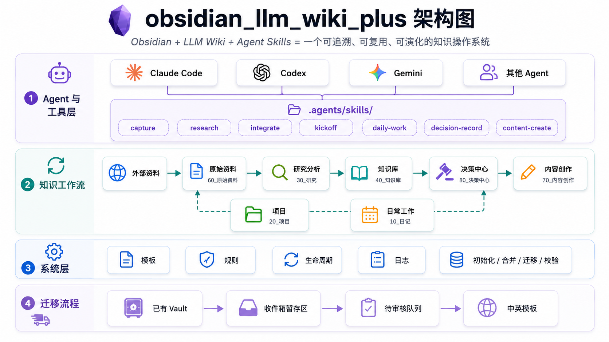

# obsidian_llm_wiki_plus

<p align="center">
  
</p>

[English](./README.md) | **中文**

**Obsidian + LLM Wiki + Agent Skills = 一个可追溯、可复用、可演化的知识操作系统。**

`obsidian_llm_wiki_plus` 是一个面向 Obsidian 和 AI Agent 的双语知识库模板项目。

它不是普通的 Obsidian 笔记模板，也不是单纯的任务管理系统，而是把以下能力组合到一个 Vault 中：

- 原始资料保存
- 深度研究分析
- 结构化 Wiki 沉淀
- 项目推进管理
- 每日计划与复盘
- 内容创作素材管理
- 长期决策记录
- Agent Skills 工作流
- 已有 Vault 的安全迁移与升级

你可以直接使用 `CN/` 或 `EN/` Vault 模板，也可以用内置 CLI 把它安装、合并、迁移或升级到已有 Obsidian Vault 中。

---

## 为什么做这个项目？

很多人使用 Obsidian、Notion、Markdown 或各种知识库工具时，会遇到几个长期问题：

1. **资料很多，但很难追溯来源**  
   看过很多网页、PDF、GitHub 项目、文章、视频，但后面很难知道某个结论来自哪里。

2. **笔记很多，但没有变成知识系统**  
   笔记是孤立的，缺少实体、概念、观点、决策、方法论、综合分析之间的连接。

3. **AI 对话很有价值，但用完就丢了**  
   和 LLM 讨论出来的方案、判断、代码思路、内容选题，经常散落在聊天记录里，无法复用。

4. **研究、项目、内容创作是割裂的**  
   今天调研的东西，明天写文章用不上；项目里的经验，后续也很难沉淀成方法论。

5. **知识会过期，但没人提醒你复查**  
   技术选型、AI 工具、模型能力、产品策略都在变化，旧结论如果不标记生命周期，容易误导后续判断。

这个项目的目标，是把 Obsidian 变成一个 AI Agent 可以安全参与维护的结构化知识操作系统。

---

## 适合谁使用？

这个模板适合：

- 持续跟踪 AI、Agent、LLM、本地模型、工具生态的技术人员；
- 希望把项目经验、架构判断、方案设计沉淀成长期资产的团队或个人；
- 需要从研究资料中持续产出文章、推文、视频脚本、选题库的内容创作者；
- 已经在使用 Obsidian，但希望让 AI Agent 更稳定地参与资料整理、研究、知识沉淀和复盘的人；
- 希望保留原始来源、避免 AI 总结失真，并能持续复查旧结论的人。

它不适合只想要极简日记模板、普通待办清单，或者不希望维护任何结构化规则的用户。

---

## 快速开始

### 方式一：从 GitHub 一条命令安装

安装中文版 Vault：

```bash
npx github:twj515895394/obsidian_llm_wiki_plus install --lang CN --target ./my-vault
```

安装英文版 Vault：

```bash
npx github:twj515895394/obsidian_llm_wiki_plus install --lang EN --target ./my-vault
```

当目标目录为空时，安装器会直接初始化新 Vault。

当目标目录非空时，安装器会询问你要：

1. 合并缺失模板文件；
2. 覆盖模板文件；
3. 迁移另一个来源目录到暂存区；
4. 取消。

默认情况下，安装器不会删除旧文件，也不会在未确认时覆盖已有文件。

### 方式二：使用本地 Python 工具

克隆仓库后执行：

```bash
git clone git@github.com:twj515895394/obsidian_llm_wiki_plus.git
cd obsidian_llm_wiki_plus
python tools/init.py --lang CN --target ./my-vault
```

英文版：

```bash
python tools/init.py --lang EN --target ./my-vault
```

### 方式三：手动复制模板目录

```bash
cp -r CN my-vault
# 或
cp -r EN my-vault
```

手动复制仍然支持，但实际使用更推荐 CLI 安装器。

---

## 升级已有 Vault

如果你已经在使用旧版本 `obsidian_llm_wiki_plus` Vault，推荐使用安全升级流程，而不是重新复制整套模板。

先检查：

```bash
npx github:twj515895394/obsidian_llm_wiki_plus doctor --lang CN --target ./my-vault
```

查看差异：

```bash
npx github:twj515895394/obsidian_llm_wiki_plus diff --lang CN --target ./my-vault
```

生成升级计划，不修改文件：

```bash
npx github:twj515895394/obsidian_llm_wiki_plus upgrade --lang CN --target ./my-vault
```

确认后执行安全新增：

```bash
npx github:twj515895394/obsidian_llm_wiki_plus upgrade --lang CN --target ./my-vault --apply
```

升级策略：

- 默认不覆盖已有文件；
- 默认不删除用户文件；
- 默认不移动用户内容；
- `--apply` 只复制安全缺失文件，例如新 Skill 和命令适配层；
- 内容不同的入口文件、模板文件和 README 会放入 `.olwp/upgrade-staging/` 供人工合并；
- 升级计划会写入 `90_计划/待审核/`；
- 升级清单会写入 `99_系统/日志/`。

完整命令清单见：

- [CN/OLWP_COMMANDS.md](./CN/OLWP_COMMANDS.md)
- [EN/OLWP_COMMANDS.md](./EN/OLWP_COMMANDS.md)

---

## 迁移已有 Obsidian Vault

如果你已经有自己的 Obsidian Vault 或 Markdown 文档目录，不建议直接手动复制到 `40_知识库/`。

推荐使用迁移流程：

```bash
npx github:twj515895394/obsidian_llm_wiki_plus migrate \
  --lang CN \
  --source ./old-vault \
  --target ./new-vault \
  --init-template \
  --apply
```

英文版迁移：

```bash
npx github:twj515895394/obsidian_llm_wiki_plus migrate \
  --lang EN \
  --source ./old-vault \
  --target ./new-vault \
  --init-template \
  --apply
```

迁移设计是安全优先：

- 复制文件，而不是移动文件；
- 不删除旧 Vault；
- 旧文档先进入收件箱暂存区；
- 生成迁移计划和 manifest；
- 后续由用户和 Agent 使用 `research`、`integrate`、`decision-record` 逐步整理。

---

## 让 AI Agent 帮你安装

你可以对 Claude Code、Codex、Gemini CLI 或其他 Agent 说：

```text
帮我安装 obsidian_llm_wiki_plus 到当前 Obsidian Vault。
GitHub 仓库是：https://github.com/twj515895394/obsidian_llm_wiki_plus。
如果目录为空，就初始化 CN 版。
如果目录不为空，先询问我是合并模板、覆盖模板文件，还是迁移已有文档。
不要直接覆盖已有文件。
```

Agent 应执行类似命令：

```bash
npx github:twj515895394/obsidian_llm_wiki_plus install --lang CN --target .
```

英文版：

```bash
npx github:twj515895394/obsidian_llm_wiki_plus install --lang EN --target .
```

更多说明：

- [Agent 安装说明](./docs/CN/agent-install.md)
- [自动化说明](./docs/CN/automation.md)

---

## 仓库结构

```text
obsidian_llm_wiki_plus/
├── README.md
├── README_CN.md
├── LICENSE
├── package.json
├── bin/
│   └── olwp.mjs
├── docs/
│   ├── CN/
│   └── EN/
├── tools/
├── CN/
└── EN/
```

| 路径 | 说明 |
|---|---|
| `README.md` | 英文 README |
| `README_CN.md` | 中文 README |
| `CN/` | 中文 Obsidian Vault 模板 |
| `EN/` | 英文 Obsidian Vault 模板 |
| `docs/CN/` | 中文设计与使用文档 |
| `docs/EN/` | 英文设计与使用文档 |
| `tools/` | Python 初始化、迁移、校验工具 |
| `bin/olwp.mjs` | 支持 `npx github:...` 的 Node CLI 安装器 |
| `package.json` | CLI 包元数据 |

---

## Vault 结构

### 中文模板

```text
CN/
├── START_HERE.md
├── README.md
├── CLAUDE.md
├── AGENTS.md
├── GEMINI.md
├── OLWP_COMMANDS.md
├── 00_收件箱/
├── 10_日记/
├── 20_项目/
├── 30_研究/
├── 35_问答沉淀/
├── 40_知识库/
├── 50_资源/
├── 60_原始资料/
├── 70_内容创作/
├── 80_决策中心/
├── 90_计划/
├── 99_系统/
├── .agents/
├── .claude/
├── .gemini/
└── .codex/
```

### 英文模板

```text
EN/
├── START_HERE.md
├── README.md
├── CLAUDE.md
├── AGENTS.md
├── GEMINI.md
├── OLWP_COMMANDS.md
├── 00_Inbox/
├── 10_Daily/
├── 20_Projects/
├── 30_Research/
├── 35_QA_Library/
├── 40_Knowledge_Base/
├── 50_Resources/
├── 60_Raw_Sources/
├── 70_Content_Creation/
├── 80_Decision_Center/
├── 90_Planning/
├── 99_System/
├── .agents/
├── .claude/
├── .gemini/
└── .codex/
```

---

## Agent Skills

主 Skill 目录是：

```text
.agents/skills/
```

当前版本包含 10 个核心 Skill：

| Skill | 作用 |
|---|---|
| `ask` | 轻量问答，快速解释、判断和回答简单问题，避免过度流程化。 |
| `capture` | 捕获外部链接、GitHub 仓库、PDF、本地文件、网页、视频、论文、长文本等原始资料。 |
| `research` | 对项目、技术、工具、产品、主题做深度研究。 |
| `integrate` | 将研究结果、问答、项目经验和非结构化文本沉淀到结构化 Wiki。 |
| `kickoff` | 启动新项目、新系统、新专题或长期任务。 |
| `daily-work` | 支持开始一天、每日计划、每日记录和每日复盘。 |
| `decision-record` | 记录技术选型、架构决策、产品判断、内容策略和项目路线。 |
| `content-create` | 从知识库生成 X、公众号、小红书、视频脚本和内容简报。 |
| `archive` | 归档已完成项目、已处理收件箱、过期计划和阶段性资料。 |
| `obsidian-markdown` | 规范 frontmatter、wikilink、callout、embed、tag 和附件引用。 |

工具专属目录只做适配层：

```text
.claude/commands/
.gemini/commands/
.codex/commands/
```

它们指向 `.agents/skills/`，不重复维护规则。

---

## 核心设计原则

1. **资料可追溯**  
   原始链接、文件、截图、PDF、视频、粘贴文本，先作为来源保存，再加工成结论。

2. **证据和解释分离**  
   `60_原始资料/` 保存证据，`30_研究/` 保存分析，`40_知识库/` 保存可复用知识，`80_决策中心/` 保存重要决策。

3. **知识可演化**  
   知识页应包含来源、状态、置信度、复查时间、待验证问题等元数据。

4. **迁移与升级安全优先**  
   已有旧笔记先进入收件箱暂存区；已有 Vault 升级默认只生成计划，不自动覆盖用户内容。

5. **Agent 友好执行**  
   复杂操作通过短 Skill 路由，而不是依赖一个巨大的总规则文件。

---

## 文档

中文文档：

- [设计说明](./docs/CN/design.md)
- [使用指南](./docs/CN/usage-guide.md)
- [Skill 系统](./docs/CN/skill-system.md)
- [目录映射](./docs/CN/directory-map.md)
- [双语维护规则](./docs/CN/bilingual-rules.md)
- [自动化说明](./docs/CN/automation.md)
- [Agent 安装说明](./docs/CN/agent-install.md)
- [质量检查](./docs/CN/quality-check.md)

英文文档：

- [Design](./docs/EN/design.md)
- [Usage guide](./docs/EN/usage-guide.md)
- [Skill system](./docs/EN/skill-system.md)
- [Directory map](./docs/EN/directory-map.md)
- [Bilingual rules](./docs/EN/bilingual-rules.md)
- [Automation](./docs/EN/automation.md)
- [Agent install](./docs/EN/agent-install.md)
- [Quality check](./docs/EN/quality-check.md)

---

## 校验项目结构

```bash
python tools/validate-structure.py --strict-placeholders
```

或：

```bash
npm run validate
```

---

## 当前状态

当前发布目标：**v1.2.0**

已包含：

- CN / EN 双语 Vault 模板
- 根目录中英文 README
- Agent 入口文件
- 10 个核心 Skill
- 系统规则与模板
- Claude、Gemini、Codex 命令适配层
- Python 初始化 / 迁移 / 校验工具
- Node CLI 安装器
- 已有 Vault 迁移工作流
- 已有 Vault 安全升级机制：`doctor / diff / upgrade`
- CN / EN 命令清单：`OLWP_COMMANDS.md`

---

## License

MIT